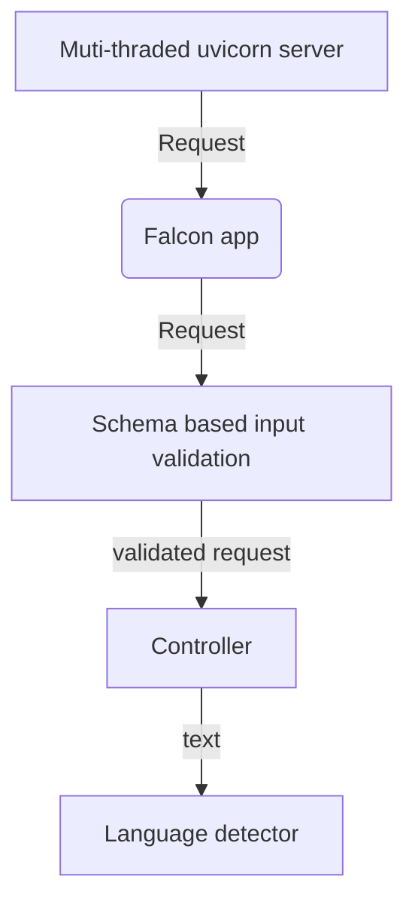
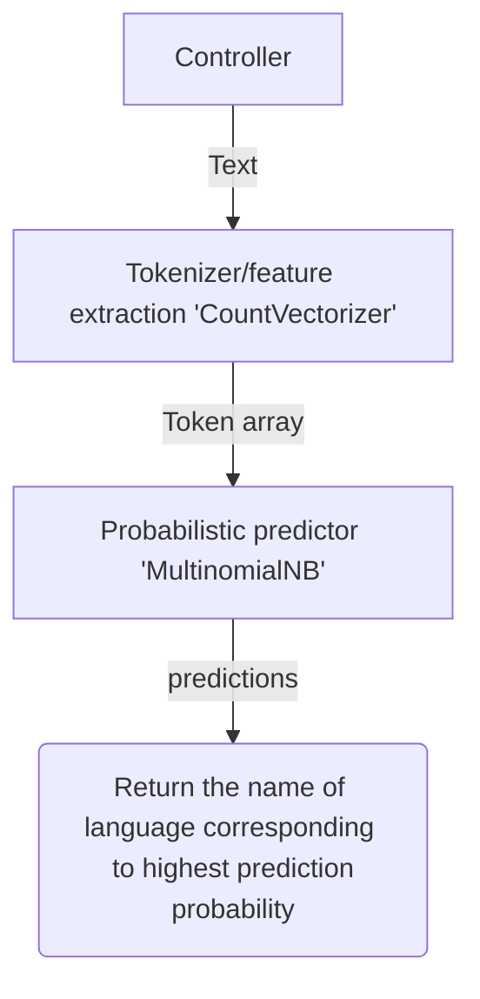

# Design considerations

## Assumptions
1. Task is to build a general purpose language detection system
    * Since there were no specific requirement to develop system for accuracy/performance , an assumption is made to develop general purpose system
    * There will be trade-off between accuracy , performance and resource consumption 
2. The system should be transparent - meaning it should be easy to trace how a particular results were made
3. System should be easy to maintain / improve

## Design choices
1. Since the requirement is not to build an highly accurate system, considering resource consumption, transparency & maintainability Recurrent neural network based solutions are omitted.
2. For a simple, transparent text classifier, Multinomial Naive Bayes based text classifier is selected.

## Constrains
1. Availability of dataset.
    * Number of languages supported and quality of prediction greatly depends on quality of the training dataset.
    * As there were no specific requirements regarding the list of languages to be supported and the dataset was not provided, it was decided to limit the number of languages to those available in any quality public dataset available.


# Architecture

### Api server


### Language detector




# Accuracy

Accuracy was tested using an entirely different dataset and its results are show below
```
          total  failed  success_percent
Chinese     500     485              3.0
Japanese    500     459              8.2
Hindi       500      19             96.2
Urdu        500      18             96.4
Turkish     500      13             97.4
Dutch       500      12             97.6
Thai        500       5             99.0
Arabic      500       4             99.2
Spanish     500       3             99.4
English     500       1             99.8
Russian     500       0            100.0
French      500       0            100.0
```

From the test results, it is clear that, this model is not suitable for detecting Chinese / Japanese kind of languages.
It is because, they have very large number characters and hence number of possible words will be even bigger.
Unless we train our model with very large corpus ( which will result model with large size and high memory usage ) it can not detect Chinese / Japanese family of languages
For correctly detecting these languages we have following options
1. Check the unicode characters in the text and if majority are Chinese / Japanese , skip model based prediction and respond with results
2. LSTM based models will be able make prediction more accurately by analyzing character sequences. Try to implement such solution

# Performance
Simple apache benchmark utility shows following statistics on machine with "Intel(R) Core(TM) i5-3340M CPU @ 2.70GHz (4 threads)" & 8GB RAM
```
Concurrency         Req/sec             time/actual-req (ms)
10                  96.12               0104.032
50                  98.33               0508.481
100                 98.43               1015.908
```

# Api documentation

Api documentation is auto generated by API server itself using OpenAPI spec.
it can be accessed either from http://127.0.0.1:8000/apidoc/swagger ( Swagger UI ) or http://127.0.0.1:8000/apidoc/redoc ( Redocly UI)
An HTML documentation generated from OpenAPI spec is also included in the project directory for the reference
